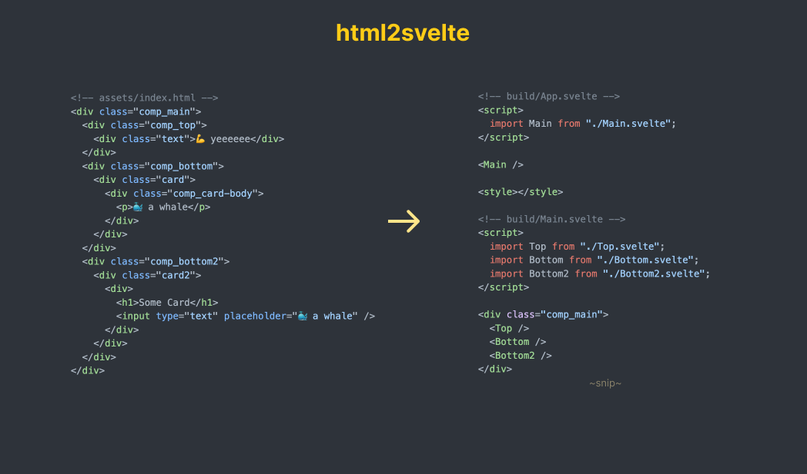

# html2svelte

> Convert HTML to Svelte components in a snap

Svelte is pretty 🔥 and is a nice way to build web apps. This is a small tool that helps turn your HTML into Svelte components.

I especially like that its much easier to design/style an app, and then add logic. This is quite different than React, where you have to think about the logic/components first, and then build/style them.

There are a list of other "reasons why" you should use Svelte, but thats left as an exercise to the reader.

## 💃 Try it out

[Convert HTML to Svelte Instantly ⚡️](https://drbh.github.io/html2svelte/)


## 💥 TLDR;

Add `comp_` to the class names of your HTML elements and run `html2svelte` on your HTML files.



### 📦 Install from npm

```bash
npm install -g html2svelte
```

### 📖 Docs

```
$ html2svelte help
cli for html2svelte

VERSION
  html2svelte/0.0.1b darwin-x64 node-v16.17.0

USAGE
  $ html2svelte [COMMAND]

COMMANDS
  convert  Convert a HTML file to Svelte Components
  help     Display help for html2svelte
```

```
$ html2svelte convert --help
Convert a HTML file to Svelte Components

USAGE
  $ html2svelte convert [FILE]

ARGUMENTS
  FILE  html file to convert

OPTIONS
  -o, --outDir=outDir  [default: build] folder to output the converted
                       files to

  -p, --prefix=prefix  [default: comp_] prefix to used to determine which
                       elements to convert
```

### 🛠️ Build from source

```bash
git clone https://github.com/drbh/html2svelte.git
cd html2svelte
npm run bootstrap
# now you can run the tool
html2svelte convert assets/index.html
prettier --plugin-search-dir . build/*.svelte -w
```

## ⚙️ How it works

1. The script will look for all the HTML file based on the cli argument passed.
2. It parses the HTML and look for all the elements with a class name that starts with `comp_`.
3. Then it creates a Svelte component for each of those elements, and replace the HTML with the component, writing the new HTML to the `build/` folder.
4. `prettier` is run with the `svelte` plugin to format the final code.

## 🧠 Thoughts

- [ ] should have built-in prettier support
- [ ] could/should be a vs code extension
- [ ] should support more functionality
- [ ] should handle non single div cases better